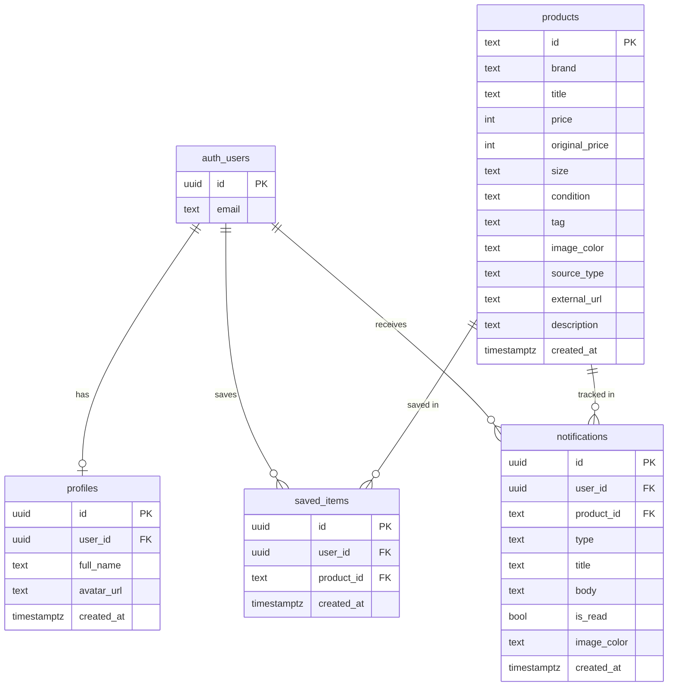

<div dir="rtl">

# ChicCheap 🛍️

**אגרגטור אופנה חכם — מצאי את הלוק המושלם במחיר הכי טוב ברשת.**

🔗 **[האתר החי](https://chiccheap-react.vercel.app)**  
🔗 **[GitHub Repository](https://github.com/Shayoren212/ChicCheap-react)**

---

## מה המוצר עושה

ChicCheap משלבת פריטי אופנה מחנויות מותג (H&M, Zara, Mango ועוד) יחד עם פריטי יד שנייה מיד2 מרקט — בפיד אחד, עם סינון חכם לפי צבע, קטגוריה, מחיר ומצב. המשתמשת יכולה לשמור פריטים לרשימת משאלות, לעקוב אחרי שינויי מחיר, ולהגיע ישירות לעמוד הרכישה הספציפי.

---

## הבעיה שהמוצר פותר

קנייה חכמה של אופנה בישראל מצריכה כיום לפחות 5–6 כרטיסיות פתוחות במקביל: אתר H&M, Zara, יד2 מרקט, וינטאג' בפייסבוק וכו׳. אין מקום אחד שמשווה מחירים בין חנויות מותג לבין שוק היד שנייה. התוצאה: משתמשות מפסידות מציאות, משלמות מחיר מלא על פריטים שניתן למצוא בחצי מחיר, ומאבדות זמן רב בחיפוש ידני.

---

## קהל היעד

נשים צעירות (18–35) בישראל שמחפשות להיראות טוב מבלי לשלם מחיר מלא. הן קונות גם מחנויות מותג וגם יד שנייה, מודעות למחיר, ומחפשות חוויית קנייה נוחה, מרוכזת וחסכונית.

---

## מתחרים ובידול

| מתחרה | מה הוא עושה | מה חסר לו |
|--------|-------------|-----------|
| יד2 מרקט | יד שנייה בלבד | אין חנויות מותג, אין סינון חכם |
| H&M / Zara / Mango | חנות מותג בלבד | אין יד שנייה, אין השוואה |
| Google Shopping | השוואת מחירים | לא כולל יד שנייה ישראלית |
| Vinted / eBay | יד שנייה בינלאומית | לא ממוקד ישראל, ממשק לא בעברית |
| ״לעשות ידנית״ | פתיחת כרטיסיות | גוזל זמן, אין סינון, אין מעקב מחיר |

**הבידול של ChicCheap:**
- **פיד אחד** — מותג + יד שנייה ביחד, מעורבבים 50/50
- **סינון עברי חכם** — לפי צבע, קטגוריה, מחיר ומצב בו זמנית
- **מעקב מחיר** — התראה כשמחיר פריט ירד
- **ממשק עברי מלא + RTL** — מותאם לשוק הישראלי

---

## ארכיטקטורת המוצר

```
משתמש
  ↓
React SPA (Vite)
  ├── Supabase Auth (אימות + Google OAuth)
  ├── Supabase DB (פרופיל, wishlist, התראות)
  ├── Shopify products.json API (חנויות מותג)
  ├── Yad2 Market API (יד שנייה)
  └── Supabase Edge Function → Gemini AI (ניתוח תמונת אופנה)
```

---

## תרשים ERD — מודל הנתונים



> **RLS (Row Level Security):** כל טבלה מוגנת — משתמש רואה ומשנה רק את הנתונים שלו.

---

## שירותים חיצוניים ואינטגרציות

| שירות | סוג | שימוש |
|--------|-----|--------|
| **Supabase** | BaaS | בסיס נתונים (PostgreSQL), Auth, Edge Functions, RLS |
| **Google OAuth** | אימות | התחברות מהירה דרך חשבון גוגל (דרך Supabase Auth) |
| **Shopify products.json** | API ציבורי | שליפת קטלוג פריטים מחנויות מותג (H&M, Zara, Mango, Nike, Adidas, Nautica) |
| **Yad2 Market API** | API ציבורי | שליפת מודעות יד שנייה בקטגוריית אופנה |
| **Gemini AI (Google)** | AI API | ניתוח תמונת אופנה והמלצת קטגוריה + צבע — דרך Supabase Edge Function (המפתח מוסתר בצד השרת) |

> **אבטחת מפתחות:** מפתח Gemini מוסתר ב-Supabase Edge Function ולא חשוף בקוד הצד-לקוח.

---

## הזרימה המרכזית (User Flow)

1. **הרשמה / כניסה** — אימייל + סיסמה, או Google OAuth
2. **חיפוש** — הקלדת קטגוריה / מותג / סגנון בעברית
3. **סינון** — צבע, קטגוריה, מחיר, מקור (חנות / יד שנייה)
4. **כרטיס פריט** — תמונה, מחיר, מצב, מוכר, לב לשמירה
5. **מעקב מחיר** — ״עקבי אחרי המחיר״ → התראה בעמוד ההתראות
6. **רכישה** — קישור ישיר לעמוד הפריט בחנות / מודעה ביד2

---

## משתמש דמו לבדיקה

ניתן להירשם עם כל כתובת אימייל דרך עמוד ההרשמה (נדרש אימות אימייל).  
לחלופין — כניסה דרך Google OAuth ישירות.

> **הערה:** סינון הצבע, הקטגוריה ומעקב מחיר דורשים חיבור לאינטרנט ל-Yad2 ולחנויות המותג.

---

## הרצה מקומית

```bash
git clone https://github.com/Shayoren212/ChicCheap-react
cd ChicCheap-react
npm install
```

צרי קובץ `.env`:
```
VITE_SUPABASE_URL=your_supabase_url
VITE_SUPABASE_ANON_KEY=your_anon_key
```

```bash
npm run dev
```

האפליקציה תרוץ על `http://localhost:5173`

---

## מבנה הפרויקט

```
src/
  components/
    Navbar/          ← ניווט עליון
    Footer/          ← תחתית
    FilterModal/     ← פופ-אפ סינון מתקדם
    AuthCard/        ← כרטיס הרשמה / כניסה
    ProductCard/     ← כרטיס מוצר
  pages/
    HomePage/        ← /home — חיפוש, סינון, תוצאות
    ProductPage/     ← /product/:id — פרטי פריט מלאים
    NotificationsPage/ ← /notifications — התראות מחיר
    ProfilePage/     ← /profile — רשימת משאלות + הגדרות
    LoginPage/       ← /login
    RegisterPage/    ← /register
  context/
    AuthContext/     ← ניהול מצב המשתמש
supabase/
  schema.sql         ← הגדרת טבלאות + RLS + seed data
  functions/
    analyze-fashion-image/  ← Edge Function: Gemini AI
    search-products/        ← Edge Function: חיפוש מוצרים
```

## Tech Stack

- **Frontend:** React 18, React Router v6, Vite, CSS Variables (RTL)
- **Backend:** Supabase (PostgreSQL + Auth + Edge Functions)
- **AI:** Gemini API (Google) דרך Edge Function
- **APIs חיצוניים:** Shopify products.json, Yad2 Market API
- **Deployment:** Vercel

</div>
